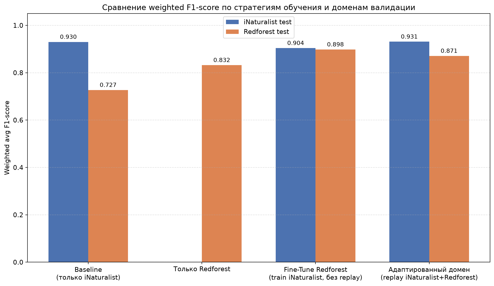

# animal-species-classifier

Цель проекта. Обучить модель классификации животных на фотографиях с камер-ловушек из сегмента СНГ.

Проблема. Для СНГ почти нет данных. Из открытых источников удалось найти только один открытый датасет с фотоловушек, расположенных в СНГ-сегменте — RedForest, снимки из чернобыльской зоны: около 4 тысяч фотографий, порядка 10 видов. В датасете RedForest множество групп фотографий сделаны во время одной встречи с животным, из-за чего модель, обученная только на этом датасете, потеряет обобщающую способность и будет хуже классифиировать животных из других точек сегмента.

Есть очевидный путь закрыть нехватку данных — собрать свой датасет под задачу и разметить его вручную, как это сделали в проекте по фауне Карелии (~6700 фотографий, 8 уникальных видов животных, профессиональная разметка). Но такой датасет в открытом доступе не публиковался, а повторить его формирование без ресурсов на съёмку и разметку не получится. Открытого датасета уровня зарубежных Snapshot Serengeti или iWildCam для СНГ на сегодняшний день нет.

Гипотеза. Поскольку нет возможности провести разметку данных из требуемого сегмента, можно взять примеры из другого сегмента, обработать их и добавить в обучающую выборку (адаптировать домен) и получить модель, способную лучше классифицировать исходный домен, чем модель, обученная только на исходном домене. В качестве смежного домена выбран iNaturalist из-за большого количества фотографий по представленным в RedForest видам животных. Однако, в iNaturalist, в большей степени, приведены фотографии не с камер-ловушек, а сделанные людьми. Также в домене iNaturalist представлены фотографии следов присутствия животных, а не самих животных, ввиду чего требуется дополнительная предобработка данных. 

Метрика успеха. Модель, обученная на объединении доменов (iNaturalist + RedForest), должна классифицировать отложенную выборку RedForest заметно лучше, чем модель, обученная только на RedForest или обученная только на iNaturalist.

Основная метрика. В качестве основной метрики выбран weighted avg F1-score. Сделан такой выбор, поскольку этот скор учитывает precision и recall по каждому классу и точнее отражает качество классификации в условиях присутствующего дисбаланса классов: часть видов представлена тысячами фотографий, часть — менее чем тремя десятками. Веса в weighted avg F1 соответствуют распределению видов в тестовой выборке, что соотносится с постановкой задачи — на фотоловушках редкие виды будут давать меньше кадров, чем популярные виды.

Приведенный ноутбук разделен на блоки, каждый блок имеет пояснение, какую логику он представляет.

# Установка

Для установки всех требуемых зависимостей создайтие новое окружение, перейдите в корень проекта и используйте команду: 

```
python3 -m pip install -r requirements.txt --no-cache-dir
```

Ноутбук, в котором приведен полный пайплайн исследования, находится в директории ./research/ . Наработки из ноутбука обернуты в сервис. о чем более подробно рассказано в последнем разделе. Перед запуском сервиса убедитесь, что вы скачали веса моделей с [диска](https://disk.yandex.ru/d/G2GSJS0yGQob5w) и положили их в директорию /models/ , а также добавили в директорию /source/back/data/ манифест с того же cropped_filtered-final_manifest-v2-with_net_v_klass.csv - он представляет из себя локальную базу информации об изображениях, участвовавших в обучении моделей.

# Данные

У меня не получилось выгрузить выборку RedForest программными средствами, поэтому я выгрузил ее вручную и архив с ней я добавил в [этот диск](https://disk.yandex.ru/d/G2GSJS0yGQob5w). Веса всех обученных моделей представлены там же.

Ключевая идея проекта строится вокруг домена RedForest (Чернобыльская зона) — открытого датасета камер-ловушек, где представлено порядка 10 видов фауны, характерных для лесной экосистемы средней полосы и России Проблема в том, что RedForest маленьким датсетом, содержащим в себе порядке 4тыс. фотографий с сильным дисбалансом по видам, чего будет недостаточно для обучения MVP-модели для классификации животных в отечественном сегменте. Чтобы решить эту проблему, было принято решение: использовать открытый датасет iNaturalist в качестве источника обогащения, что покрывает не только приведенные в RedForest виды, но и расширенный список из 18 видов фауны, присущих России и сопредельных регионов, включая редких и краснокнижных животных (соболь, рысь), которых на изображениях с камер-ловушек попросту недостаточно для обучения модели. Из iNaturalist отбирались подтверждённые сообществом наблюдения по каждому из целевых видов, наиболее популярные классы обрезались до 2000 примеров на класс во избежание сильного дисбаланса, а хвостовые — сохранялись целиком в том случае, если для приведенного вида набиралось более 100 примеров. В противном случае класс отбрасывался.

Поскольку наблюдения домена iNaturalist включают не только фотографии самого животного, но и следы его жизнедеятельности (следы на снегу, экскременты, погрызы), был применён предобученный детектор MegaDetector 5-й версии, что помогал определить присутствие животного в кадре (причина выбора именно что пятой версии, а не более совеременной шестой, приведена в ноутбуке). Благодаря детектору были получены bbox с животными и уверенность в присутствии животного на изображении. Записи, где детектор не находил животное вовсе, либо находил его с недостаточной уверенностью, либо обнаруженная область оказывалась подозрительной (слишком мала, что типично для кадров, где виден лишь фрагмент тела — клок шерсти, копыто, часть рога), выделялись в отдельный служебный класс - net_v_klassifikatore, который использовался в некоторых экспериментах.

Для записей, прошедших фильтрацию, выполнялась обрезка изображения по найденному боксу. Благодаря ей получилось убрать избыточный фон и сконцентрировать модель на самом объекте классификации, а не на ландшафте вокруг. Обрезка бокса проводилась с фиксированным отступом вокруг рамки, чтобы не обрезать животное впритык (в рамках тестирования выявлено, что любая из моделей сильно путала между собой рогатых, поскольку найденные боксы фокусировались только на теле животного, ввиду чего для захвата остальных признаков и брался отступ). В финальной версии использовался расширенный квадратный кроп с отступом, что решило проблему искажения пропорций тела при последующем ресайзе в квадрат и заметно снизило путаницу между морфологически различными видами.

Данные разбивались на тренировочную, тестовую и валидационную выборки стратифицированно по виду, с сохранением пропорций классов в каждой части. Для изображений домена iNaturalist разбиение проводилось на уровне уникальных наблюдений (поле observation_uuid), чтобы избежать утечки почти идентичных кадров одной серии между обучающей и тестовой частью.

Для проверки того, насколько модель, обученная на фотографиях природного сообщества, обобщается на настоящие кадры камер-ловушек, использовался открытый датасет камер-ловушек из Чернобыльской зоны под названием RedForest. Географически и видово близкий аналог отсутствующих открытых отечественных датасетов. RedForest прошёл ту же обработку (MegaDetector, фильтрация, кроп, НВК), что и обучающие данные, и использовался во всех экспериментах. В частности, в качестве обущающей выборки, в качестве валидационной выборки, в качестве части выборки для файнтюна обученной на домене iNaturalist модели.

В качестве основы для классификатора была выбрана предобученная модель DINOv2, что была обученная Meta AI на огромном массиве изображений и умеющая хорошо выделять общие визуальные признаки объектов (форму, текстуру, силуэт). В рамках условий текущей задачи было проще и правильнее выбрать уже обученную модель и подкрутить ее под задачу, а не обучать свою с нуля. Поверх DINOv2 были добавлены две небольшие головы:

- голова для классификации — обычный слой, который переводит признаки, извлечённые DINOv2, в вероятности по 18 классам;
- эмбеддинг-голова — сжимает признаки в компактный вектор, что даёт возможность в будущем сравнивать изображения между собой напрямую (например, для поиска похожих животных или индивидуальной идентификации особей по узору шкуры), не переобучая всю модель заново.

Ввиду естественного перекоса в количестве снимков видов применялись взвешенный семплер со сглаженными весами и взвешенная функция потерь.

После получения baseline-модели, обученной только на домене iNaturalist, и измерения просадки качества на целеовм домене RedForest был проведён ряд сравнительных экспериментов: обучение исключительно на целевом домене RedForest с нуля; FT предобученной модели только на части целевых данных без повторения исходного домена iNaturalist в выборке для дообучения; и финальный подход — дообучение на смеси исходных данных и части целевых, защищающее от проблемы catastrophic forgetting уже выученных признаков. Сравнение этих стратегий по weighted и macro F1-score на обоих доменах позволило количественно показать, что даже ограниченное количество данных из целевого домена, при правильном совмещении с исходным датасетом, позволяет поднять корректность классификации данных из исходного домена.

# Результаты эксперимента

В рамках эксперимента проведены следующие итерации обучения: 

1. Для получения исходных метрик, на основании которых будет определяться успех проведенного эксперимента, обучить и провалидировать модель только на домене RedForest.

2. Проверить, какие результаты покажет модель, обученная на домене iNaturalist, на домене RedForest.

3. Дообучить модель, обученную на домене iNaturalist, только на домене RedForest. Провести валидацию на RedForest и iNaturalist.

4. Дообучить модель, обученную на домене iNaturalist, на совокупности доменов iNaturalist и RedForest с целью избежать ухудшения знаний модели об исходном домене iNaturalist. Провести валидацию на RedForest и iNaturalist.



Baseline подтверждает исходную гипотезу о доменном разрыве. Модель, обученная исключительно на данных iNaturalist, показывает высокое качество на собственном домене (F1 = 0.930), но заметно теряет в качестве при переносе на снимки домена RedForest (F1 = 0.727, падение на 20 пунктов). Это количественно подтверждает, что модели, обученные на чистых фотографиях iNaturalist, не готовы к прямому применению на снимках с фотоловушек без дополнительной адаптации.

Обучение только на целевом домене ограничено объёмом данных. Модель, обученная и провалидированная исключительно на RedForest, достигает F1 = 0.832, что выше, чем baseline на этом же домене, но заметно ниже потенциала, достижимого при использовании большего объёма данных. Это ожидаемый результат: RedForest — существенно меньший по объёму датасет, чем iNaturalist, что ограничивает обобщающую способность модели, особенно на классах с малым числом примеров.

Дообучение модели только на домене RedForest даёт наилучшую адаптацию к целевому домену. Модель, дообученная поверх iNaturalist-весов исключительно на данных RedForest (без повторного появления примеров домена iNaturalist в выборке дообучения), демонстрирует наиболее выраженный прирост качества на целевом домене — F1 = 0.898, что на 17 пунктов выше baseline. При этом качество на исходном домене iNaturalist снижается умеренно — до 0.904 (−2,6 пунктов относительно baseline) — то есть эффект проблемы catastrophic forgetting присутствует, но не является критическим.

Повторное использование примеров из домена iNaturalist в выборке для дообучения наравне с примерами домена позволяет полностью сохранить качество на исходном домене (F1 = 0.931), одновременно существенно повышая качество на целевом домене (F1 = 0.871, +14,4 пунктов относительно baseline). Это самый сбалансированный результат среди всех протестированных стратегий — модель не жертвует знаниями об исходном домене ради адаптации к новому.

# Дополнительные возможности
В репозитории проекта также представлен исходный код webприложения, через которое можно взаимодействовать с разработанными моделями, а также загружать фотографии и осуществлять поиск наиболее похожих на них изображений по базе системы. Обученные модели позволяют извлекать компактные эмбеддинги изображений размерности 256, которые благодаря применению метрического обучения образуют семантически структурированное пространство, где визуально похожие животные располагаются близко друг к другу. Согласно проведенным экспериментам корректность пайплайна поиска наиболее похожих изображений (accuracy) составляет 0.927. В случае получения ложноположительных результатов, обрабатываемые изображения были крайне похожи

# Вывод

Эксперимент подтверждает исходную гипотезу проекта: модели, обученные на данных домена iNaturalist, действительно испытывают значительное падение качества при переносе на снимки камер-ловушек. Вместе с тем эксперимент показывает, что этот разрыв поддаётся эффективному сокращению даже при относительно небольшом объёме целевых данных домена RedForest, доступных для дообучения.

Стратегия replay-дообучения (совместное использование исходного и целевого доменов в выборке дообучения) продемонстрировала оптимальное соотношение между адаптацией к новому домену и сохранением ранее полученных знаний, что делает её предпочтительной для практического применения в задачах классификации фауны по снимкам с камер-ловушек в условиях ограниченной доступности размеченных данных целевого региона.

# Воспроизведение, запуск

Ноутбук должен без проблем воспроизводиться после установки зависимостей. Для создания воспроизводимости экспериментов заморожены рандом стейты.

Сервис разрабатывался и тестировался на ОС Ubuntu 24.04.4 LTS, ввиду чего при запуске сервиса на других ОС могут возникнуть проблемы с путями. Для удобства тестирования системы был спроектирован и разработан API, находящийся в директории ./source/back/ . Для запуска API, после установки зависимостей, требуется воспользоваться командой: 

```
python3 main.py
```

После вызова команды API поднимется на localhost:8000. Всего API предоставляет 3 ручки: 

1. GET - /health. Ручка для проверки доступности сервиса

payload - нет
return - {"status": "ok"}

2. POST - /classify. Ручка для классификации изображения

payload - files: image
return - {"animal": str, "conf": float}

3. POST - /find_nearest. Ручка для поиска наиболее похожих изображений на отправляемое

payload - files: image
return - {"image": str, "similarity": float}

Всего в системе 6 модулей: 

1. app.py - тело api, обработка запросов и ответов на запросы

2. main.py - запуск API

3. model_manager.py - взаимодействие с моделями

4. records_base.py - своеобразная логика взаимодействия с бд

5. schemas.py - схемы для ручек API

6. tools.py - класс со вспомогательными методами, что не имеют сильной логической связи с другими модулями

